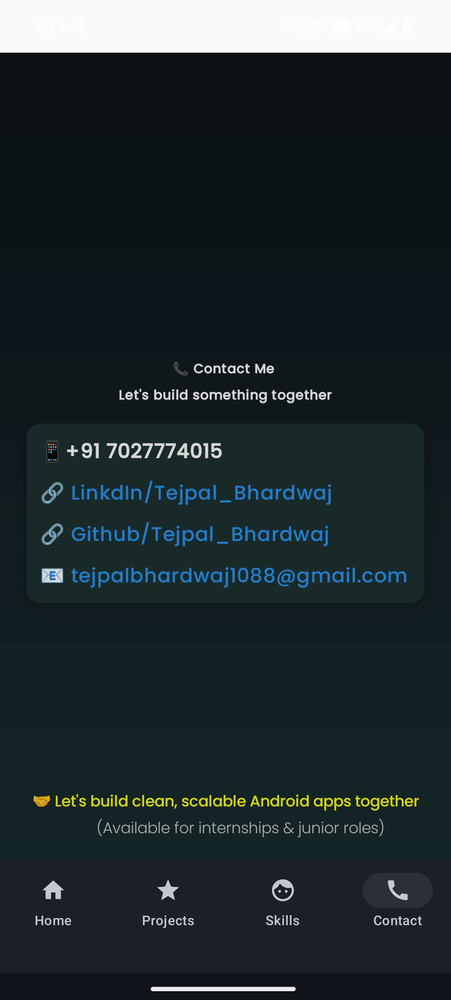
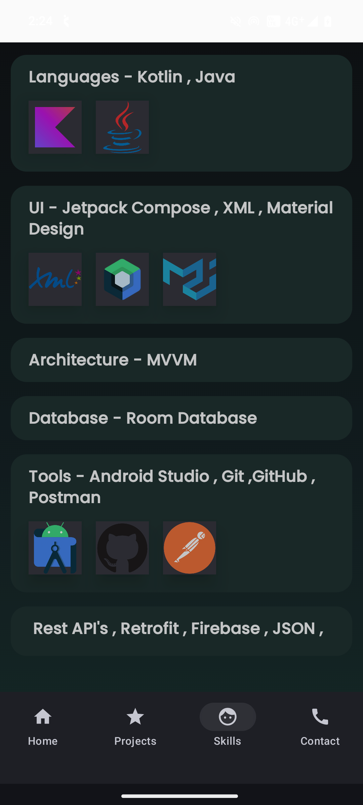
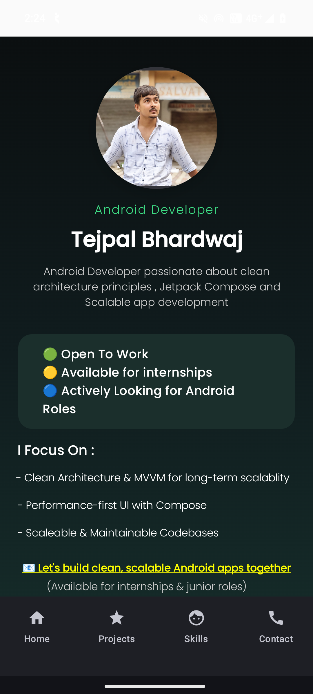
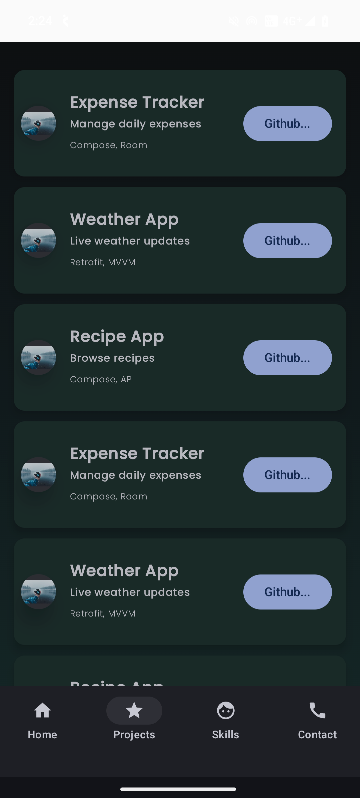

# 📱 Tejpal Portfolio

## Overview

A modern **Android portfolio application** built using **Kotlin** and **Jetpack Compose**, showcasing profile, skills, and projects with a clean, premium dark UI inspired by contemporary mobile designs.

---

## ✨ Features

* 🧑‍💻 **Profile Screen**
  Elegant profile layout with a large circular image, name, role, description, and stats card.

* 🧩 **Projects Section**
  Displays featured projects with clean cards and technology tags.

* 🛠 **Skills Section**
  Skill representation using progress indicators.

* 🧭 **Bottom Navigation**
  Smooth navigation between Home, Projects, and Skills screens.

* 🌙 **Dark / Gradient UI**
  Premium dark theme with modern gradients and rounded components.

---

## 🧱 Tech Stack

* **Language:** Kotlin
* **UI:** Jetpack Compose
* **Architecture:** Modular & Compose-first (MVVM ready)
* **Navigation:** Navigation Compose
* **Design:** Material 3

---

## 📂 Project Structure

```text
com.example.tejpalportfolio
│
├── MainActivity.kt
│
├── navigation
│   └── AppNavGraph.kt
│
├── Screens
│   ├── HomeScreen.kt
│   ├── SkillScreen.kt
│   ├── ProjectScreen.kt
│   └── Contact.kt
│
├── components
│   ├── BottomBar.kt
│   └── ProjectCard.kt
│
├── model
│   └── Project.kt
│
└── ui.theme
    ├── Color.kt
    ├── Theme.kt
    └── Type.kt
```

---

## 🚀 Getting Started

### Prerequisites

* Android Studio Hedgehog or later
* Minimum SDK 24+

### Setup

* Clone the repository

```bash
git clone https://github.com/your-username/tejpal-portfolio.git
```

* Open the project in **Android Studio**
* Sync Gradle and run the app on an emulator or physical device

---

## 📸 Screenshots

<p align="center">
  
  
  
  
</p>

---

## 🔮 Future Improvements

* ✨ Animations (Compose Motion / AnimatedVisibility)
* 🧊 Glassmorphism effects
* 🔗 Social links (GitHub, LinkedIn)
* 🧠 ViewModel + StateFlow
* 🌐 Dynamic content from API

---

## 👨‍💻 Author

* **Tejpal Bhardwaj**
  Android Developer | Kotlin | Jetpack Compose

---

## 📄 License

* This project is open-source and available under the **MIT License**.

---

⭐ If you like this project, feel free to star it and use it as inspiration for your own portfolio!
